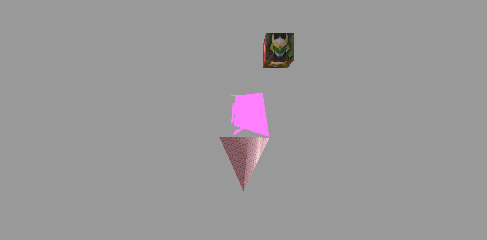
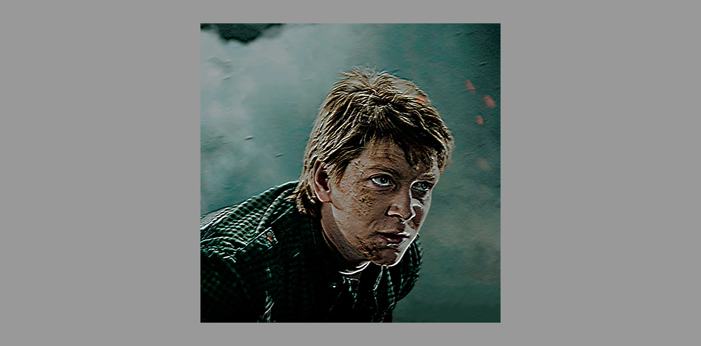
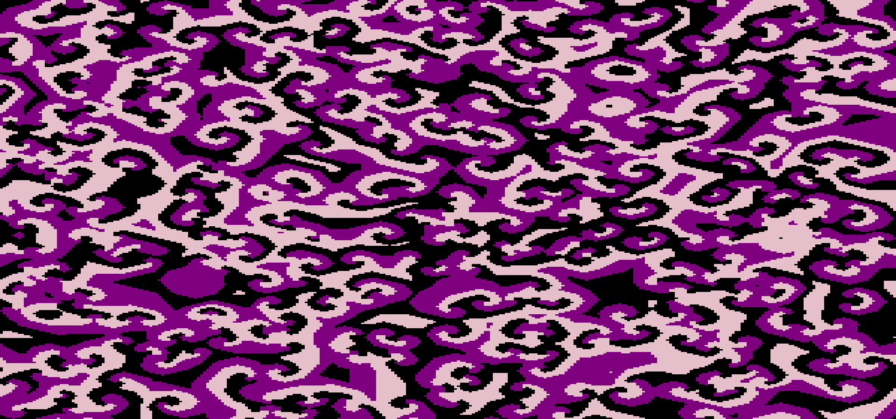

# CMPM163_HW1
Alfredo Cuevas
acuevas5@ucsc.edu

I use the three.js code inside of the js/ folder. This code was not written by me. For mor information on this code go to https://threejs.org/. 

PartA- <b>HW1PartA.html</b>
My code produces 3 objects and 3 lights (not including ambient light). There are three different fragment/vertex shader pairs. Each is used with three different objects. One cube uses the phong shader code provided by Professor Forbes and adds a texture to it. This object also has 2 lights (blue and purple) that go back and forth in different directions. The second cube is created using BoxBufferGeometry and uses a shader to displace its vertices. Its colors also fluctuate based on a variable that changes over time. The third object is a cone object that has a waffle cone texture applied to it. It reacts to a light that goes from side to side. 

PartB- <b>Hw1PartB.html</b>
My code uses a filter kernal to apply a right sobel effect on a picture of Fred from Harry Potter. The shader reads in the rgb values of texels and applies a matrix to them. It then adds up the values and mixes them with with the original picture. 

PartC- <b>HW1PartC.html</b>
I mainly altered the shader code and apply some of the rules from https://softologyblog.wordpress.com/2013/08/29/cyclic-cellular-automata/. I created three different states that are based on the red values. The states go from 0-0.33, 0.34-0.66, and 0.67-1.0 . Whenever a cell has 3 or more neighbors of the appropriate state then it changes to that state as well. This produces a nice cyclical affect. I also altered Professor Forbes code so that the initial setup randomly produced all three colors, not just black and white.

PartD- <b>HW1PartD</b>
I took a picture from Dark Souls 3 and tried to describe the some of the effects. Mainly I was that there was a skybox, that the water reacted to light and movement, and that cloth moved dynamically. This part of the assignment made it kind of clear how little I know. Despite being able to pick out a few things I couldn't really go into detain about how the effects might have been made. 
